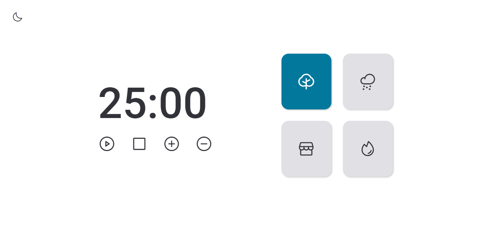

# focus-timer-2.0
 Versão aprimorada do focus timer desenvolvido no exercício anterior

  

## 🖥️ Projeto
Versão aprimorada do Focus Timer com adição de sons ao clique do botão, foram utilizados conceitos de modularização, timeOut, function, :not no css entre outros. 

## 🚀 Tecnologias
Foi desenvolvido esse projeto com as seguintes tecnologias:

- HTML
- CSS
- JAVASCRIPT
- FIGMA
- GIT
- GITHUB
